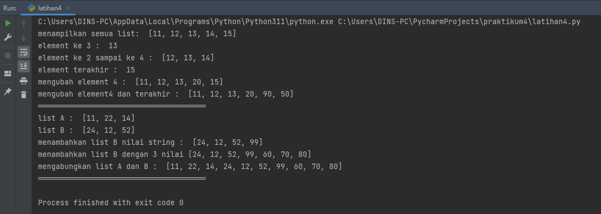
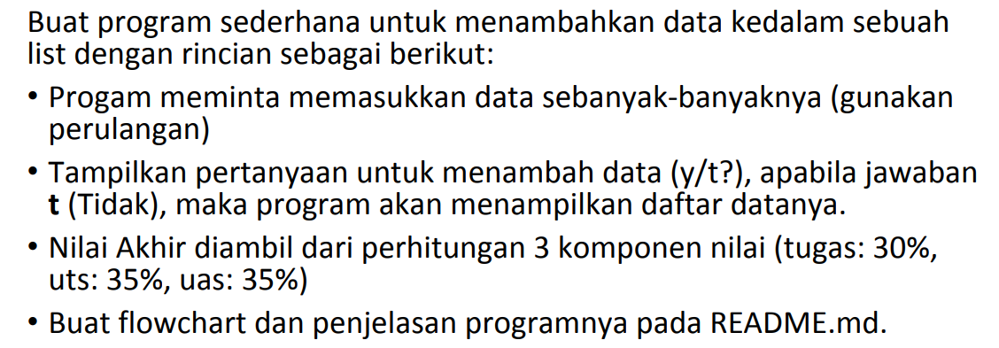
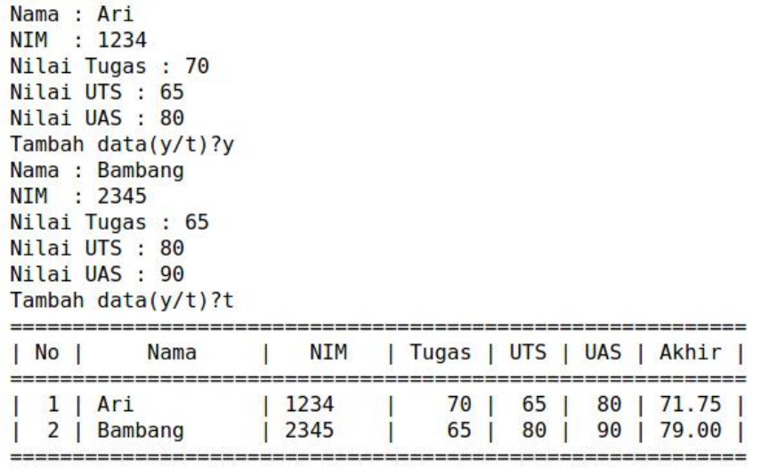
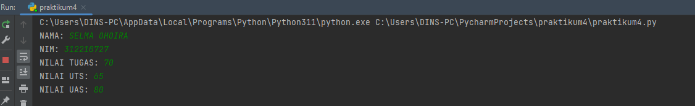
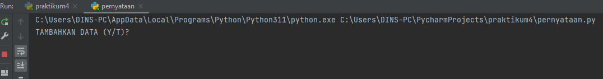
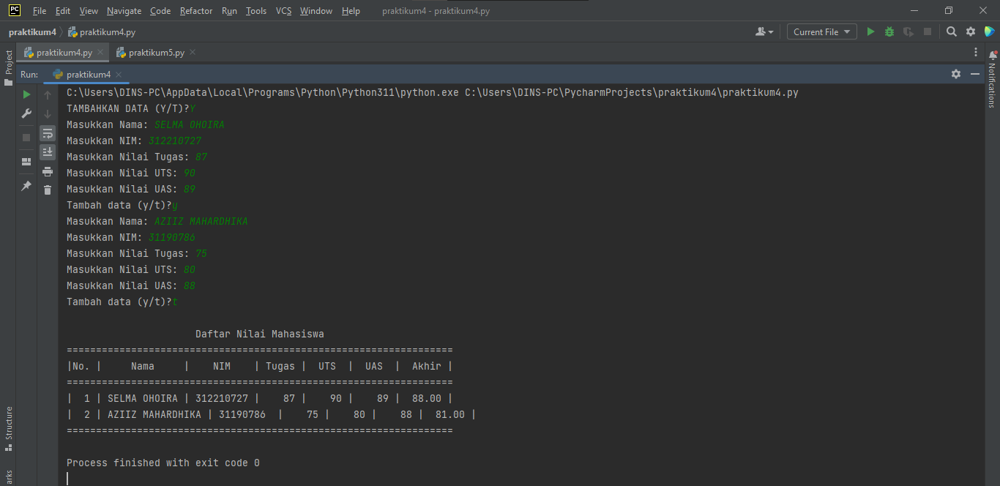
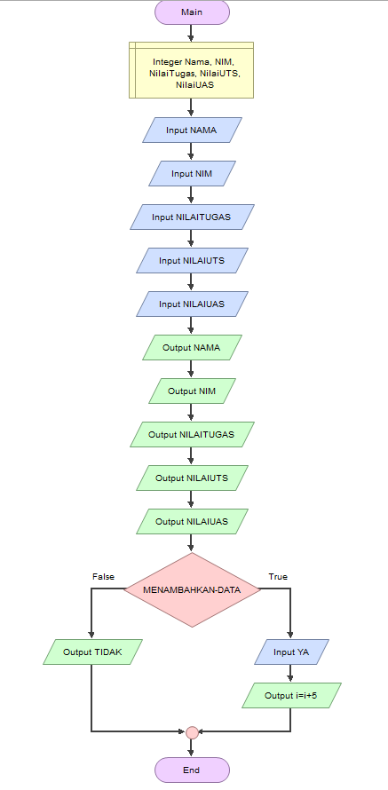

# Tugas Pertemuan ke 9

Nama    : Selma Ohoira

NIM         : 312210727

Kelas       : TI.22.C9

Mata Kuliah : Bahasa Pemograman

## Latihan 4

Masukan syntax berikut:

    #Akses pada list
    data = [11,12,13,14,15]
    print ("menampilkan semua list: ", data[0:6])
    print ("element ke 3 : ", data[2])
    print ("element ke 2 sampai ke 4 : ", data[1:4])
    print ("element terakhir : ", data[4])
    #mengubah element list
    data[3] = 20
    print("mengubah element 4 : ", data)
    data[4:5] = 90,50
    print("mengubah element4 dan terakhir : ", data)
    print("══════════════════════════════════════")
    #menambahkan element
    dataa = [11,22,14]
    datab = [24,12,52]
    print("list A : ", dataa)
    print("list B : ", datab)
    datab.append(99)
    print ("menambahkan list B nilai string : ", datab)
    datab.extend([60,70,80])
    print ("menambahkan list B dengan 3 nilai", datab)
    print ("mengabungkan list A dan B : " ,dataa + datab)
    print("══════════════════════════════════════")

Hasil output latihan 4

# PRAKTIKUM 4
Soal

Dengan hasil outpunya sbb:

Disini diminta untuk memasukan data sebanyak-banyaknya. Jadi saya akan mencoba memasukan beberapa data
diantaranya seperti NAMA, NIM, NILAI TUGAS, NILAI UTS dan NILAI UAS

Untuk dapat menambahkan data-data tersebut, masukan code seperti ini:

    nama = input("NAMA: ")
    nim = input("NIM: ")
    tugas = int(input("NILAI TUGAS: "))
    uts = int(input("NILAI UTS: "))
    uas = int(input("NILAI UAS: "))

Setelah itu run, hasil outputnya seperti ini:

Selanjutnya diminta untuk membuat sebuah pernyataan YA/TIDAK pada pertanyaan 'apakah ingin menambahkan sebuah data?'.
Masukkan code berikut:

    if (input("TAMBAHKAN DATA (Y/T)?") == ''):
    ulang = False

Setelah itu run, hasil outputnya seperti ini:

Selanjutnya membuat variable perulangan while:

    # Variable ulang = True digunakan untuk mengontrol perulangan.
    nilai = []
    ulang = True

    while ulang:
        nama = input("Masukkan Nama: ")
        nim = input("Masukkan NIM: ")
        tugas = int(input("Masukkan Nilai Tugas: "))
        uts = int(input("Masukkan Nilai UTS: "))
        uas = int(input("Masukkan Nilai UAS: "))
        akhir = (tugas * 30/100) + (uts * 35/100) + (uas * 35/100)

    # t akan membuat variable ulang = True menjadi ulang = False yang mana akan menghentikan perulangan yang terjadi.
        nilai.append([nama, nim, tugas, uts, uas, int(akhir)])
        if (input("Tambah data (y/t)?") == 't'):
            ulang = False
    # proses hasil dari looping
    print("\n                      Daftar Nilai Mahasiswa")
    print("==================================================================")
    print("|No. |     Nama     |    NIM    | Tugas |  UTS  |  UAS  |  Akhir |")
    print("==================================================================")
    i = 0
    for item in nilai:
        i += 1
        print("| {no:2d} | {nama:12s} | {nim:9s} | {tugas:5d} | {uts:5d} | {uas:5d} | {akhir:6.2f} |"
            .format(no=i, nama=item[0], nim=item[1], tugas=item[2], uts=item[3], uas=item[4], akhir=item[5]))
    print("==================================================================")

# HASIL OUTPUT

# FLOWCHART PROGRAM

SELESAI!!